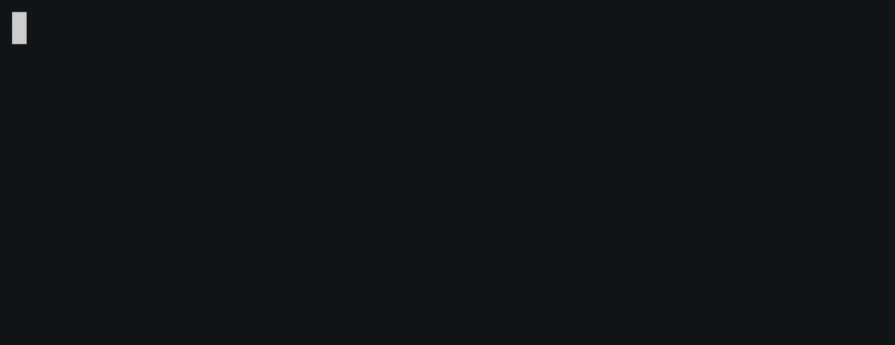

# Webpack watch server


A single `webpack-watch-server` command to add to your package scripts that fires up [Webpack](https://webpack.js.org) in watch mode and restarts your server each build. Webpack and server logs stream in a unified console with clear formatting and pretty colors.

By using a Webpack build callback under the hood, this package is much more efficient than using a seperate watcher (such as [Nodemon](https://nodemon.io) or [Forever](https://github.com/foreverjs/forever)) to restart the server.



## Install

With [npm](https://www.npmjs.com):

```
npm install webpack-watch-server
```

## Usage

1. Add `"dev": "webpack-watch-server"` to your `package.json` scripts. To specify a custom Webpack config file path use `webpack-watch-server --config path/to/custom-webpack-config.js`. The file will be transpiled with Babel if it’s name ends with `.config.babel.js`.
2. Run `npm run dev` to start Webpack in watch mode. The server automatically starts and restarts after each build.

## Caveats

- It is assumed your server file is the default Node finds at the Webpack config `output.path` – `index.js` works.
- For now, only plain object Webpack configs are supported.

## Support

- Node >= 6.4.
